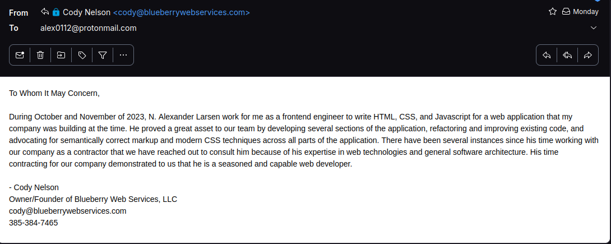

# Credit For Prior Learning

This is a small web page addressing the requirements of the prior learning credit for Web I at UVU.

### Why I need this CPL credit:

I am a few credits shy of recieving my associates degree in computer science from UVU. The only remaining course I need to take is CS 2250. It is my goal to obtain my associates degree this semester before continuing with my bachelor's degree in computer engineering.

### My qualifications and experience

Since 2012 I have had a variety of professional positions or internships that involved me writing code for the web in some capacity. I have taken a somewhat non-traditional career path and my full technical work experience can be viewed on my [LinkedIn profile](https://www.linkedin.com/in/kingsfoil/details/experience/)

Outlined below is a brief summary of work experience I've had since I began working. This is not an exhaustive list, I am only highlighting roles I believe to be relevant to the course material:

#### BetterLinux - Summer 2012

My first internship was at a company called BetterLinux. In my time there I pair programmed a web page that collected data from a small MySQL table about CPU usage statistics and displayed it on a web page. This job entailed the use of HTML, JavaScript, jQuery, and CSS.

#### Morinda Inc. - Summer 2013

My second internship was at Morinda Bioactives (formerly Tahitian Noni) in their web development department. I spent the summer helping out with miscellaneous tasks that mostly involved writing HTML templates using the [HTML::Mason](https://metacpan.org/pod/HTML::Mason) library.

In the process of digging up old web development projects I found [this page](https://web.archive.org/web/20130814151559/http://truage.com/en-us/truage/home.html) in the wayback machine that I believe I wrote most of and had to style according to a design document that was given to me from someone in another department.

#### Discovery Space Center - Jan 2014 to Jun 2014

At the discovery space center I spent six months designing and implementing a web application that would allow customers to generate a unique id number for themselves and generate a badge with a QR code on it in order to track rewards points. This app was written with the (Mojolicious::Lite)[https://mojolicious.org/] templating library and the old [jQuery UI](https://jqueryui.com/) library.

#### Techcyte - Jun 2014 to Dec 2014

At Techcyte I was hired on with the founder of a small startup at a startup incubator. I sat in the same room as the founder and I was assigned to build a Ruby on Rails application that read machine learning data from a shared database and allowed the user to annotate a set of classified images. At this job I was introduced to Model-View-Controller architecture and separation of concerns. I believe the original web application I wrote has evolved into Techcyte's [Blood Differential Product](https://techcyte.com/products/automated-blood-differential/). The application looks very different from when I wrote it but you can see a screenshot of it [here](https://techcyte.com/wp-content/uploads/2023/03/Human-Blood-UI-Example-348x197.jpg)

#### Bluehost - Mar 2017 to Aug 2019

At Bluehost I worked on a software development team doing quality assurance and SDET. I was responsible for assuring that the code my team was deploying met the requirements outlined by the product owners, and was responsible for deploying the finished changes to a cluster of production servers. 

While working on automated software tests I gained a great deal of experience writing css selectors. Many of the pages the tests had to work through were very old and not written using semantically correct CSS (often there were no valid `id` attributes for unique elements, which made them difficult to select). I would sometimes get around this problem by using xpath selectors, but these were less than ideal and could prove brittle as the pages would often change. It would have been much easier if the pages followed best practices for semantic HTML/CSS.

At this job I learned a lot about ReactJS since it had recently become quite popular. A major initiative was rolled out to transition the existing web application (an old Perl/CGI app with an in house framework) to a new React application. My team was often tasked with extending the feature set of the React app.

I left this job in 2019 to start my freshman year at UVU at the age of 22.

#### Podium Summer 2020 & Mar 2021 to Aug 2022

I worked at Podium as an Application Security Engineer/Software Engineer on the Security Team. While in these positions I was in charge of triaging security reports from our bug bounty program, and had to manually reproduce security writeups submitted by security researchers through [HackerOne](https://www.hackerone.com/). I learned a great deal about web security at this position.

Additionally while at podium I actively developed [attercop](https://github.com/podium/attercop). A (now archived) GraphQL security scanner. I also wrote [a piece of middleware](https://github.com/podium/vigil) to prevent data exfiltration from GraphQL error messages.

#### Chirp Reviews - Mar 2023 to Jul 2023

Over the summer in 2023 I worked for a company that contracted through UVU's E2I program. I participated in meetings with the founder and implemented a web application related to online product reviews.

While here I ended up writing a small browser extension using the [Plasmo SDK](https://docs.plasmo.com/framework), and a web application with a Ruby on Rails backend and a [Next.js](https://nextjs.org/). My team and I also put together a small proof of concept web scraper tool in Python.

#### Blueberry Web Services - Oct 2023 to Nov 2023

A friend of mine recently started a web consulting business. I contracted with him briefly to prototype some of the front end pages his team needed.

He wrote me this letter of recommendation:

